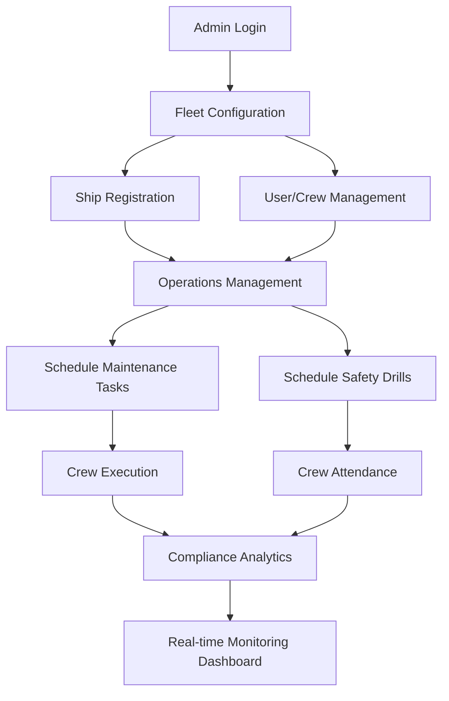

# Business Flow: Fathom Marine Operations

This document outlines the core operational workflows and business logic of the Fathom Marine Compliance System.

## 1. High-Level Process Overview

---

## 2. Detailed Workflows

### A. Ship & Crew Onboarding (Admin Only)
1. **Ship Registration:** Admin registers new vessels with IMO numbers, tonnage, and built year.
2. **Crew Assignment:** Admin creates user accounts and assigns them to specific vessels. Only `ADMIN` roles can manage multiple ships; `CREW` are restricted to their assigned vessel.

### B. Maintenance Management
1. **Task Creation:** Admin creates maintenance tasks (e.g., Engine Check, Lifeboat Inspection) for a ship.
2. **Priority & Deadlines:** Tasks are assigned priorities (Low/Medium/High/Critical) and due dates.
3. **Execution:** Crew members log in to see their assigned tasks. They update the status from `PENDING` to `IN_PROGRESS` and finally `COMPLETED`.
4. **Overdue Logic:** The system automatically marks tasks as `OVERDUE` if they surpass the due date without completion.

### C. Safety & Compliance Drills
1. **Scheduling:** Admin schedules safety drills (e.g., Fire Drill, Abandon Ship) for a vessel.
2. **Attendance:** Crew members on the ship must mark their attendance.
3. **Missed Drills:** If a drill is not marked as `COMPLETED` by the scheduled time, the system automatically marks it as `MISSED`.

### D. Compliance Dashboard & Analytics
1. **Data Aggregation:** The system calculates compliance rates based on:
   - Percentage of completed vs. total maintenance tasks.
   - Percentage of attended vs. scheduled safety drills.
2. **Visual Reporting:** The dashboard provides:
   - Color-coded compliance rings (Green = High, Amber = Medium, Red = Low).
   - Monthly trend charts showing operational performance.
   - Per-ship breakdown for fleet-wide oversight.

---

## 3. User Roles & Permissions

| Feature | Admin | Crew Member |
| :--- | :---: | :---: |
| View Fleet Dashboard | ✅ | ✅ (Own ship only) |
| Manage Ships | ✅ | ❌ |
| Manage Users | ✅ | ❌ |
| Create Tasks/Drills | ✅ | ❌ |
| Update Task Status | ✅ | ✅ (Assigned only) |
| Mark Drill Attendance | ✅ | ✅ |
| View Detailed Reports | ✅ | ❌ |
